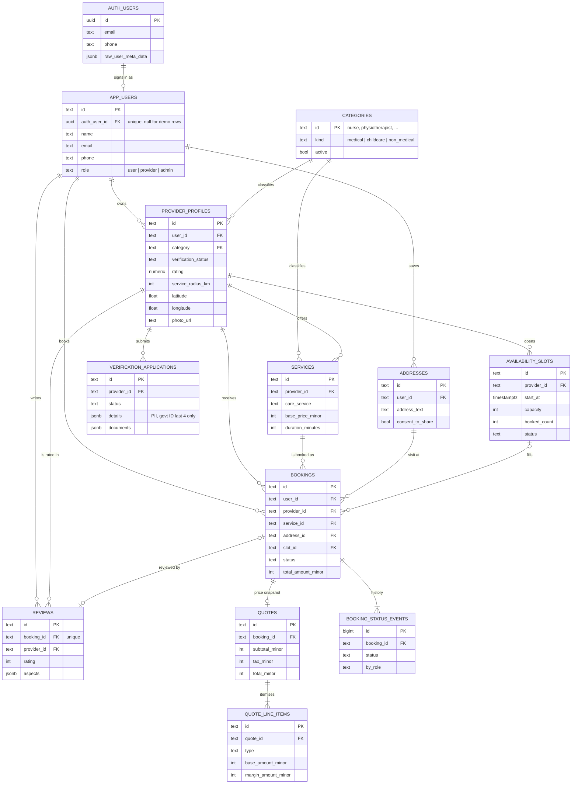

# Database design — Supabase (Postgres + Auth + Storage)

HealNest Bharat runs on one Supabase project:

| Supabase service | Used for |
| --- | --- |
| **Postgres** | All app data: catalogue, providers, slots, bookings, price snapshots, reviews, verification, config, audit log |
| **Auth** | Sign-up and log-in (phone OTP, email, Google). `auth.users` is linked 1:1 to `public.app_users` |
| **Storage** | Provider profile photos (public) and verification documents (private) |

Schema lives in [`supabase/migrations/`](../supabase/migrations/) and runs in filename order:

| Migration | Adds |
| --- | --- |
| `20260910000000_init.sql` | Core tables, immutable quote snapshots, RLS switched on everywhere |
| `20260910010000_care_services.sql` | `services.care_service` tag |
| `20260911000000_verification_and_reviews.sql` | Profile photos, slot capacity / booked count, review aspects + one review per booking, verification applications |
| `20260911010000_auth.sql` | Auth link + sign-up trigger, RLS read policies, Storage buckets |
| `20260911020000_remove_doctors.sql` | Deletes doctor providers and everything tied to them (bookings, services, slots, reviews, verification applications, their user accounts) and the `doctor` category; drops `provider_profiles.practice`, `services.online_price_minor`, `availability_slots.mode`, `bookings.consult_mode`. Run it on existing databases; safe on fresh ones |

## Entity-relationship diagram



Standalone tables: `pricing_rules` (one row per line-item type), `platform_config` (single row, `id = 1`),
`audit_logs` (append-only).

## Tables by area

**Identity**
- `auth.users` — managed by Supabase Auth. Never written by the app.
- `app_users` — the app's user record and **role** (`user`, `provider`, `admin`). `auth_user_id` links it to Auth.
  Ids are text (`user_<uuid-hex>` for real accounts, `user_demo` for seed data).

**Catalogue**
- `categories` — nurse, physiotherapist, phlebotomist, babysitter, caregiver.
- `provider_profiles` — one per caretaker: location, service radius, credentials, verification status, rating and photo.
- `services` — what a provider sells, with the visit price in paise.
- `availability_slots` — time windows with `capacity` / `booked_count` (a CHECK keeps `booked_count <= capacity`).
  Each slot takes one booking.

**Bookings and money**
- `addresses` — visit location, with the customer's consent to share it with the caretaker.
- `bookings` — the order. Keeps copies of the provider and service names so it still reads correctly if the catalogue changes.
- `quotes` + `quote_line_items` — price snapshot at booking time. **Immutable**: a trigger rejects updates.
- `booking_status_events` — REQUESTED → ACCEPTED → ON_THE_WAY → ARRIVED → IN_PROGRESS → COMPLETED (or DECLINED / CANCELLED).
- All money is integer **minor units (paise)**.

**Trust**
- `reviews` — one per booking (unique index), with aspect sub-ratings.
- `verification_applications` — caretaker KYC and registration, reviewed by admins.

**Platform**
- `pricing_rules`, `platform_config`, `audit_logs`.

## How Auth fits in

```
Sign up (phone OTP / email / Google)
        │
        ▼
auth.users row ──trigger on_auth_user_created──▶ public.app_users row
                                                   id   = user_<uuid-hex>
                                                   role = 'provider' if metadata.account_type = 'caretaker'
                                                          else 'user'
```

- **Role assignment.** Sign-up metadata comes from the client, so it can only pick customer or caretaker.
  **Admin is never self-assigned.** Promote staff with SQL (below).
- **Caretakers.** A new caretaker has role `provider` but no `provider_profiles` row yet. Onboarding creates one
  (`verification_status = 'unverified'`), then submits a `verification_applications` row. Admins approve it.
- **Email / phone changes** in Auth are copied to `app_users` by `on_auth_user_updated`.
- **Deleting an Auth account** sets `auth_user_id` to null. The app user and their booking history stay.

## Access model (RLS)

The server writes with the **service-role key**, which bypasses RLS. That keeps pricing, quote immutability and slot
counting in one place (the API). RLS is a second line of defence, and it makes reads with the publishable key safe.
**No table has insert/update/delete policies**, so the browser cannot write directly.

| Table | anon | Customer | Caretaker | Admin |
| --- | --- | --- | --- | --- |
| categories, provider_profiles, services | active rows | active rows | active + own inactive | all |
| availability_slots, reviews, pricing_rules, platform_config | all | all | all | all |
| app_users | — | self | self | all |
| addresses | — | own | their bookings' addresses, **with consent** | all |
| bookings, quotes, line items, status events | — | own | their bookings | all |
| verification_applications | — | — | own | all |
| audit_logs | — | — | — | all |

Policies use three `SECURITY DEFINER` helpers: `current_app_user_id()`, `current_provider_ids()` and `is_admin()`.

## Storage

| Bucket | Public | Limit | Path | Who can upload |
| --- | --- | --- | --- | --- |
| `provider-photos` | yes | 2 MB, jpeg/png/webp | `<provider_id>/photo.jpg` | the caretaker who owns `<provider_id>` |
| `verification-documents` | no | 10 MB, pdf/jpeg/png | `<provider_id>/<file>` | the owning caretaker. Read: caretaker + admins |

Today `provider_profiles.photo_url` holds a small data URL and `verification_applications.documents` holds metadata
only. Once uploads go to Storage, store the object path there.

## Activation checklist

1. **Create a Supabase project.** Region **Mumbai (ap-south-1)** keeps health data in India (DPDP Act).
2. **Run the migrations** in order in *SQL Editor*, or with the CLI:
   ```bash
   npx supabase link --project-ref <project-ref>
   npx supabase db push
   ```
3. **Enable Auth providers** (*Authentication → Sign In / Providers*):
   - **Phone.** Choose an SMS provider (Twilio, MessageBird, Vonage or Textlocal). Commercial SMS in India needs
     DLT-registered sender IDs and templates.
   - **Email** (magic link or OTP), and optionally **Google**.
   - *URL Configuration:* Site URL `http://localhost:3000`. Add `http://localhost:3000/auth/callback` and your
     production URL to the redirect list.
4. **Environment** — `.env.local`:
   ```bash
   DATA_SOURCE=supabase
   SUPABASE_URL=https://<project-ref>.supabase.co
   SUPABASE_SERVICE_ROLE_KEY=<sb_secret_… key>          # server only
   # Needed once the app uses Supabase Auth:
   NEXT_PUBLIC_SUPABASE_URL=https://<project-ref>.supabase.co
   NEXT_PUBLIC_SUPABASE_PUBLISHABLE_KEY=<sb_publishable_… key>
   ```
5. **Seed:** `npm run db:seed` (categories, pricing rules, platform settings and the demo customer and admin — no
   providers or bookings), then `npm run dev`. The footer shows *Data source: Supabase*.
6. **Create your admin.** Sign up, or use *Authentication → Users → Add user*. Then run:
   ```sql
   update public.app_users set role = 'admin' where email = 'you@example.com';
   ```
7. **Add caretakers.** Create them from *Log in → caretaker* (demo sign-up), then submit and approve their
   verification from the provider and admin dashboards. Only verified caretakers can be booked.

## App changes still needed for real login

The database side is ready. The app still logs in through the demo cookie session (`src/lib/auth.ts`, `/api/session`).
To switch:

1. Add `@supabase/ssr`. Refresh the Auth session in `middleware.ts`, and add an `/auth/callback` route.
2. Change `getSession()` to read the Supabase user and load `app_users` by `auth_user_id` (plus
   `provider_profiles.id` for caretakers). Keep the existing `Session` shape so every `requireRole` check keeps working.
3. Replace the demo login form with phone OTP / email sign-in. Pass `options.data.account_type` = `customer` or `caretaker`
   and `full_name` on sign-up.
4. Set `DEMO_TOOLS=false` and remove the demo `POST /api/session`.
5. For production, move booking creation (address + booking + quote + events) into one Postgres function called with
   `rpc()`, so it runs in a single transaction.
